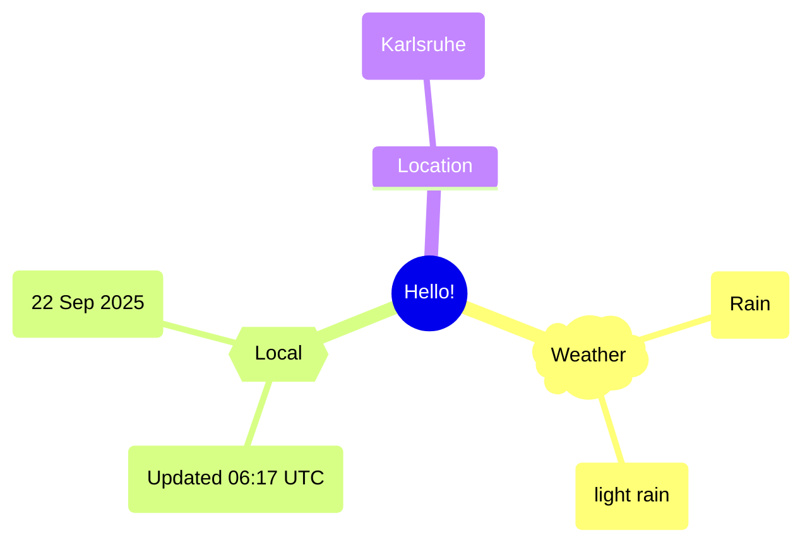
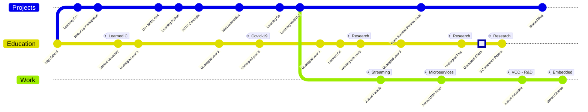

Hi there, I'm Alireza :wave:
===========================

 
Software engineer and avid learner. My passions change over time, but I've dabbed into web scraping, microservices, multimedia and applied ML. Currently exploring video and codec concepts in more depth. The best source of knowledge is the experience of others, so I try to share my experiences in my [blog](https://xosrov.github.io/).  

## About me  
- 🌱 I enjoy music, nature, gaming and fictional stories.  
- 🤔 Would love to learn more about __Big Data Management__ and learn __Rust__ & __Zig__.  
- 👨‍💻 Favorite Linux distro is [Void Linux](https://voidlinux.org/).  

## Timeline
