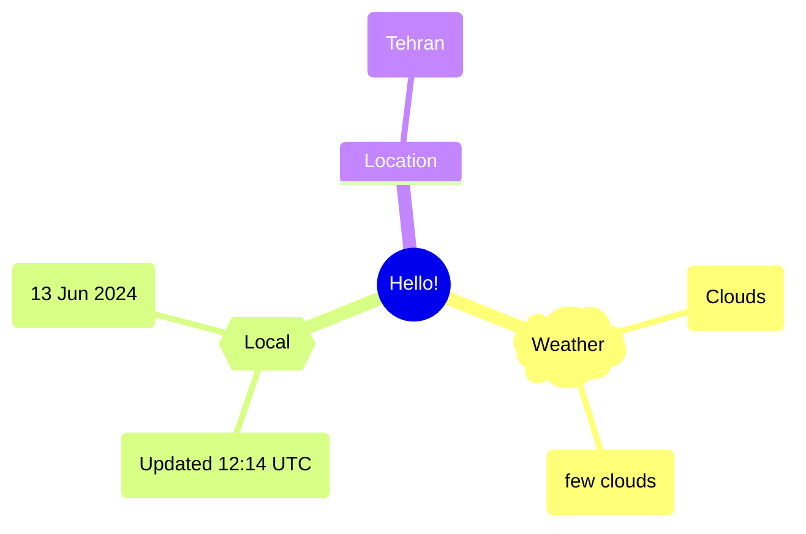
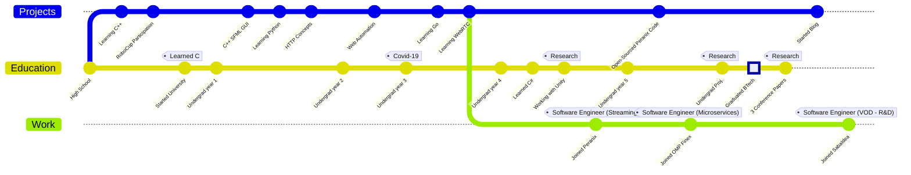

Hi there, I'm Alireza :wave:
===========================

 
Software engineer and avid learner. My passion for software has led me to explore various fields, such as web scraping, cloud gaming and multimedia. Currently exploring the aspects of creating scalable multimedia pipelines, as well as applied machine learning in different aspects of image and video processing.

## About me  
- 🌱 I enjoy music, nature, gaming and fictional stories.  
- 🔭 Interested in __web scraping__, __web automation__, __WebRTC__, __microservice architecture__, __DDD__, __multimedia__ and __encoding pipelines__.
- 🤔 Would love to learn more about __Big Data Management__ and learn __Rust__ & __Zig__.
- 👨‍💻 Favorite Linux distro is [Void Linux](https://voidlinux.org/)

## Timeline

## Links

Check out my [blog](https://xosrov.github.io/blog/).