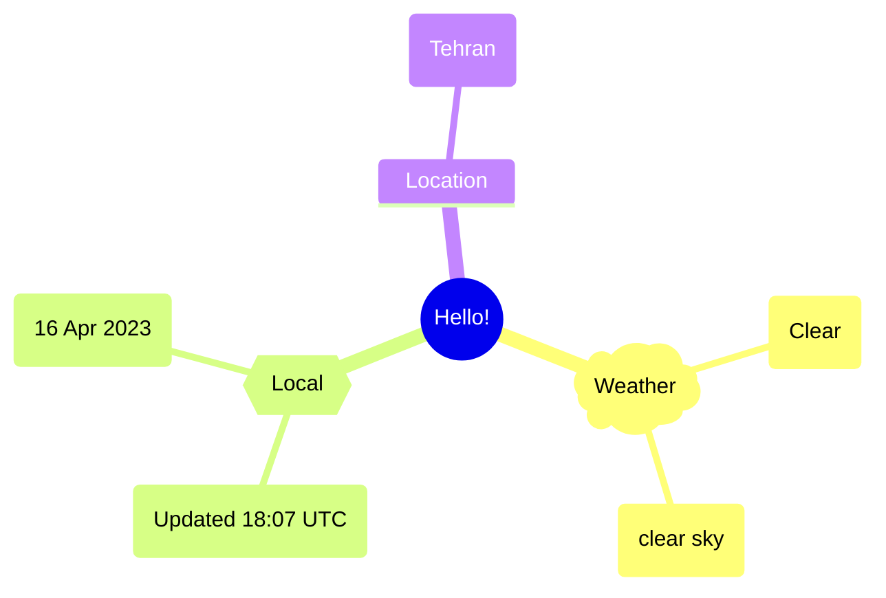
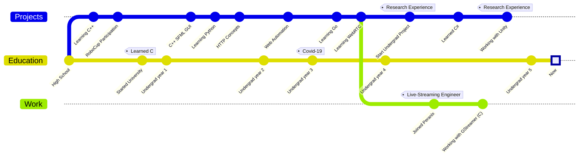

Hi there, I'm Alireza :wave:
===========================

 
I'm currently an Engineering student, and my love for programming has helped me explore various fields. Currently mainly working with GStreamer, C, Go and  occasionally HTTP/WebSocket automation with Python.  

## About me  
- 🌱 I enjoy music, nature, gaming and fictional stories.  
- 🔭 Interested in __web scraping__, __web automation__, __WebRTC__ & __livestreaming__. In love with [__GStremer__](https://gitlab.freedesktop.org/Xosrov) and the dynamic pipeline system.  
- 🤔 Would love to learn more about __Big Data Management__ and Planning to learn __Rust__ soon.  
- 👨‍💻 Currently rocking [Void Linux](https://voidlinux.org/) and [DWM](https://dwm.suckless.org/), Though Windows is still a part of my life🙂

## Timeline

## Stats

  
  

