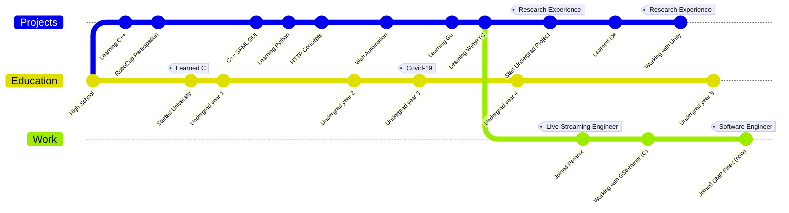

Hi there, I'm Alireza :wave:
===========================

 
Software engineer and avid learner. My passion for software has led me to explore various fields, such as cloud gaming and web scraping. Currently exploring the every growing microservice architecture and building domain-driven and clean software.

## About me  
- 🌱 I enjoy music, nature, gaming and fictional stories.  
- 🔭 Interested in __web scraping__, __web automation__, __WebRTC__, __microservice architecture__ and __DDD__.
- 🤔 Would love to learn more about __Big Data Management__ and learn __Rust__.  
- 👨‍💻 Currently rocking [Void Linux](https://voidlinux.org/) with Xfce, Though Windows is still a part of my life🙂

## Timeline

## Stats

  

